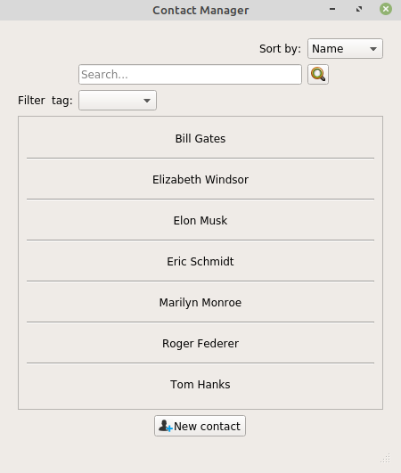
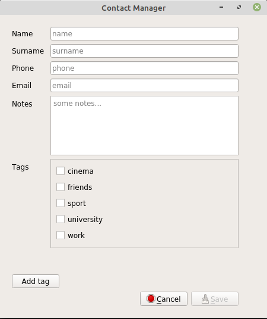
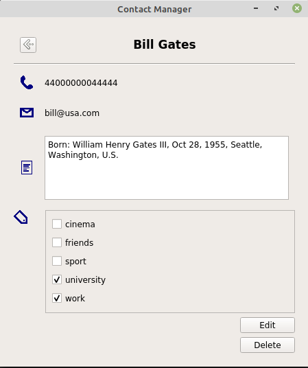
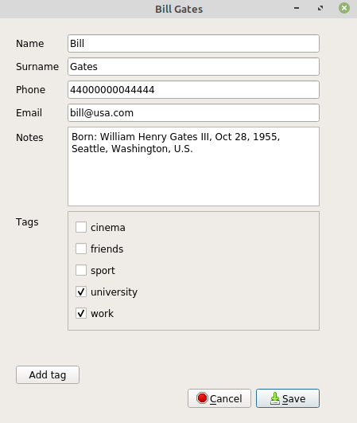

# ContactManager
This project is a contact management application.
The programming language used is python, and pyqt5 was used for the graphic interface.

## Application structure
The project has been implemented following the Model–view–viewmodel (**MVVM**) pattern: this allows to have a separation 
between the application logic and the graphical user interface.

Here there are a Model `contactsModel.py` and three views (`allContactsView.py`, `detailContactView.py` and `newContactView.py`).

## Application features
The main features of the applications are:
- **Visualization of all contacts**: in the main view you can visualize the list of all the contacts saved in the database and ***sort*** them by name or surname.
It is also possible to filter contacts by ***tags*** assigned to each contact and to ***search*** for a term present in any field of any contact. (See Figure 1)

- **Adding a new contact**: a specific form can be filled with all the required fields. Here it' also possible to ***create*** and add a ***new tag***. (See Figure 2)

- **Visualization of a specific contact**: here you can see (but not edit) all the filled fields of the selected contact, there are also two buttons to ***edit and delete*** the contact. (See Figure 3)

- **Editing contact**: this view is the same as when a new contact is inserted, but in this case the fields are already filled with the information of the selected contact and you can ***modify each field***. (See Figure 4)

Fig. 1: all contacts            |  Fig. 2: new contact
:-------------------------:|:-------------------------:
 | 

Fig. 3: contact details     |  Fig. 4: edit existing contact
:-------------------------:|:-------------------------:
 | 

### Data management
A **sqlite database** was used to store the contact data.
 For each contact you can enter the following fields:
- name
- surname
- phone number
- email 
- notes
- more than one tag

As mentioned above, you can select one of the existing tags or create a new one.

## Requirements
Python 3.7.3 was used to run this project.
The only package you need to install is PyQt5:
- `conda install -c anaconda pyqt` (with anaconda)
- `pip install PyQt5` (with pip)

## Run the application
- from terminal go to the directory in which you have downloaded the project
- go inside the ContactManager folder using the command:  `cd ContactManager`
- then run the application with the command: `python main.py`
